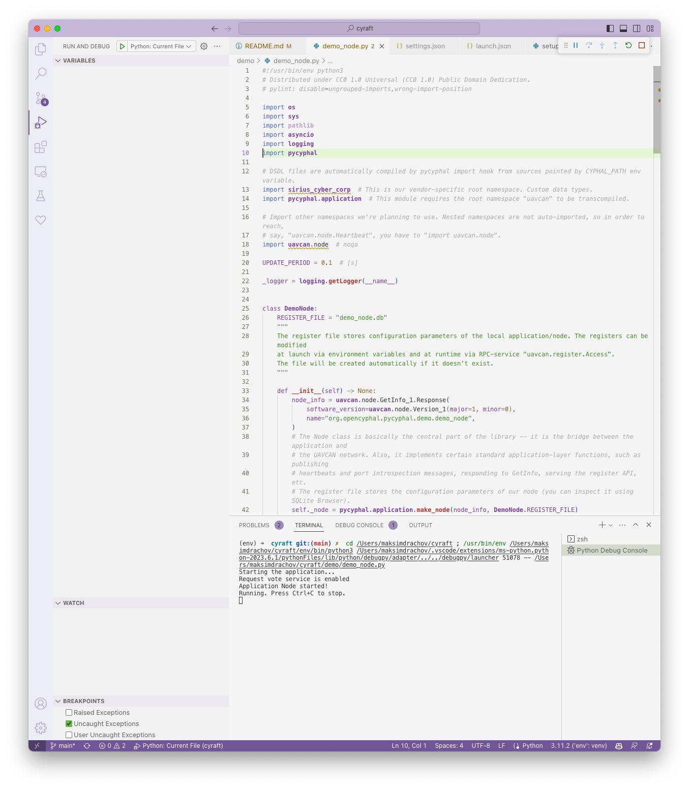
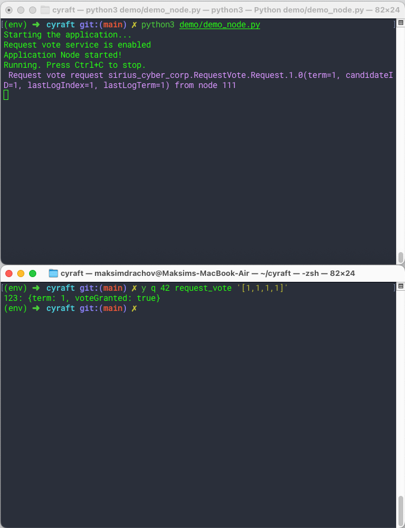
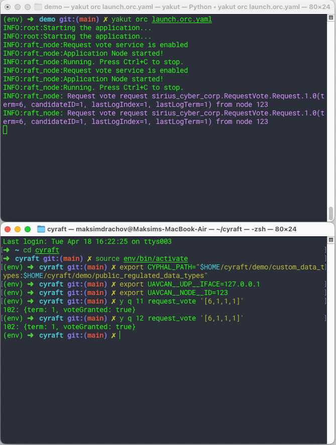
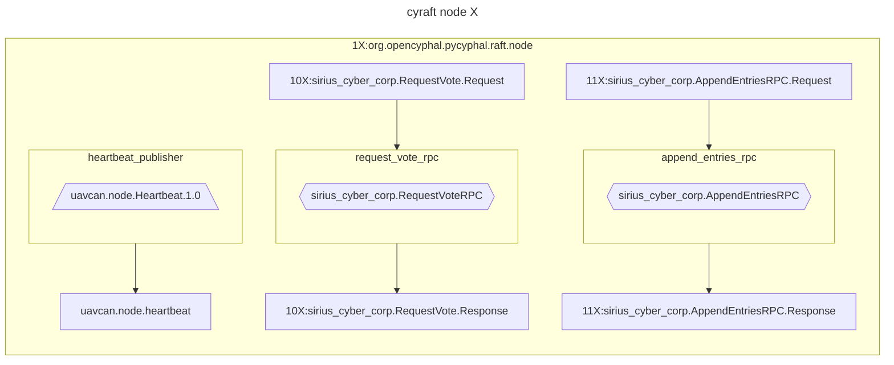
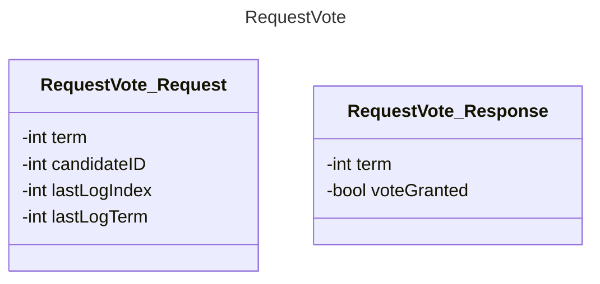
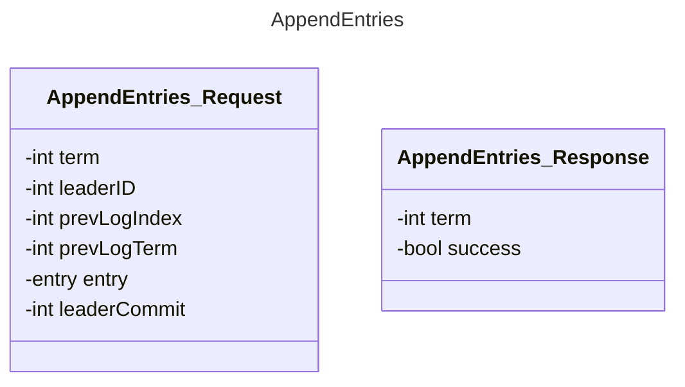

# Cyraft

The objective is to implement the Raft algorithm as an exercise, with the intention of incorporating [named topics](http://wiki.ros.org/Topics) into pycyphal. This feature is significant because it may enable Cyphal to serve as a communication interface between PX4 and ROS in the future.

(See [UAVCAN as a middleware for ROS](https://forum.opencyphal.org/t/an-exploratory-study-uavcan-as-a-middleware-for-ros/872))

- [Cyraft](#cyraft)
  - [TODO](#todo)
  - [Setup](#setup)
      - [Vscode debug setup](#vscode-debug-setup)
    - [Request Vote](#request-vote)
    - [Orchestration](#orchestration)
  - [Diagrams](#diagrams)
    - [demo\_cyraft](#demo_cyraft)
    - [DSDL datatypes](#dsdl-datatypes)
    - [Test setups](#test-setups)
      - [1 node + 1 (yakut) node](#1-node--1-yakut-node)
      - [3 nodes (using orchestration tool)](#3-nodes-using-orchestration-tool)
  - [Sources](#sources)


## TODO

24/04: Next step is finishing *Leader election*, then implementing log

- [x] Finish study pycyphal application layer
- [ ] `demo_cyraft.py`
    - [x] Add instructions on how to interact with request_vote_rpc using `yakut`
    - [x] Vscode debug setup
    - [x] Add orchestration so there's 3 nodes running simultanously
    - [ ] *Leader election*
      - at any given time each server is in one of three states: leader, follower or candidate
      - raft divides time into terms of arbitrary length, terms are numbered in concecutive integers
      - current terms exchanged whenever servers communicate; if one server's current term is smaller than the other's, then it updates its current time term
      - if a candidate or leader discovers that its term is out of date, it immediately reverts to follower state
      - if a server receives a request with a stale term number, it rejects the request
      - RequestVote RPCs are initiated by candidates during elections
      - when server start up, they begin as followers
      - server remains in follower state as long as it receives valid RPCs from a leader or candidate
      - leaders send periodic heartbeats (AppendEntries RPC that carry no log entries) to all followers to maintain authority
      - if a follower receives no communication over a period of time called the election timeout, then it begins an election to choose a new leader
      - To begin an election, a follower increments its current term and transitions to candidate state
      - it then votes for itself and issues RequestVote RPCs in parallel to each of the other servers in the cluster
      - once a candidate wins an election, it becomes a leader
      - it then sends heartbeat messages to all of the other servers to establish authority and prevent new elections
      - raft uses randomized election timeouts to ensure that split vote are rare and are resolved quickly
    - [ ] *Log Replication*
    - [ ] _serve_request_vote
      - [ ] implement log comparison
    - [ ] _start_election
    - [ ] _serve_append_entries
    - [ ] unit tests
      - [ ] _unittest_raft_node_init
      - [ ] _unittest_raft_node_request_vote_rpc
        - [ ] how to check response?
        - [ ] add test for log comparison
      - [ ] _unittest_raft_fsm
      - [ ] _unittest_raft_node_append_entries_rpc
  - [ ] `.env-variables` and `my_env.sh` should be combined?
  - [ ] Implement Github CI
-  [ ] Refactor code into `cyraft`

## Setup

- Clone repo

    ```bash
    git clone https://github.com/maksimdrachov/cyraft_project
    ```

- Virtual environment

    ```bash
    cd ~/cyraft
    python3 -m venv env
    source env/bin/activate
    ```
 
- Install requirements (pycyphal)

    ```bash
    cd ~/cyraft
    pip3 install -r requirements.txt
    ```

-   ```bash
    cd ~/cyraft/demo
    git clone https://github.com/OpenCyphal/public_regulated_data_types
    ```

-   ```bash
    export CYPHAL_PATH="$HOME/cyraft/demo/custom_data_types:$HOME/cyraft/demo/public_regulated_data_types"
    ```

- Set environment variables (registers)

    ```bash
    cd ~/cyraft
    source my_env.sh
    ```

- Run the demo

    ```bash
    python3 demo/demo_cyraft.py
    ```

    > **_NOTE:_**  Sometimes this can give an error if it's using old datatypes, try to remove ~/.pycyphal and recompile DSDL datatypes (running previous command will do this automatically)
    >   ```bash
    >   rm -rf ~/.pycyphal
    >   ```

#### Vscode debug setup

- Edit `CYPHAL_PATH` in `.env-variables` to your home directory:

    ```
    CYPHAL_PATH="/Users/maksimdrachov/cyraft/demo/custom_data_types:/Users/maksimdrachov/cyraft/demo/public_regulated_data_types"
    UAVCAN__NODE__ID=42
    UAVCAN__UDP__IFACE=127.0.0.1
    UAVCAN__SRV__REQUEST_VOTE__ID=123
    UAVCAN__DIAGNOSTIC__SEVERITY=2
    ```

- In `~/cyraft/.vscode/settings.json`:

    ```
    {
    "python.envFile": "${workspaceFolder}/.env-variables",
    }
    ```

- Vscode: Run and Debug (on `demo_cyraft.py`)

    

### Request Vote

While running the previous `demo_cyraft.py`, in a new terminal window:

- Setup

    ```bash
    cd ~/cyraft
    source env/bin/activate
    export CYPHAL_PATH="$HOME/cyraft/demo/custom_data_types:$HOME/cyraft/demo/public_regulated_data_types"
    source my_env.sh
    export UAVCAN__UDP__IFACE=127.0.0.1
    export UAVCAN__NODE__ID=111
    ```

- Send an RPC to request_vote (using `yakut`)

    ```bash
    y q 42 request_vote '[1,1,1,1]'
    ```

    

### Orchestration

<details>
<summary>`cyraft/demo/launch.orc.yaml`</summary>

```yaml
#!/usr/bin/env -S yakut --verbose orchestrate
# Read the docs about the orc-file syntax: yakut orchestrate --help

# Shared environment variables for all nodes/processes (can be overridden or selectively removed in local scopes).
CYPHAL_PATH: "./public_regulated_data_types;./custom_data_types"
# PYCYPHAL_PATH: ".pycyphal_generated"  # This one is optional; the default is "~/.pycyphal".

# Shared registers for all nodes/processes (can be overridden or selectively removed in local scopes).
# See the docs for pycyphal.application.make_node() to see which registers can be used here.
uavcan:
  # Use Cyphal/UDP via localhost:
  udp.iface: 127.0.0.1
  # If you have Ncat or some other TCP broker, you can use Cyphal/serial tunneled over TCP (in a heterogeneous
  # redundant configuration with UDP or standalone). Ncat launch example: ncat --broker --listen --source-port 50905
  serial.iface: "" # socket://127.0.0.1:50905
  # It is recommended to explicitly assign unused transports to ensure that previously stored transport
  # configurations are not accidentally reused:
  can.iface: ""
  # Configure diagnostic publishing, too:
  diagnostic:
    severity: 2
    timestamp: true

# Keys with "=" define imperatives rather than registers or environment variables.
$=:
- $=:
  # Wait a bit to let the diagnostic subscriber get ready (it is launched below).
  - sleep 2
  - # An empty statement is a join statement -- wait for the previously launched processes to exit before continuing.

  # Launch the demo app that implements the thermostat.
  - $=: python3 demo_cyraft.py
    uavcan:
      node.id: 11
      srv.request_vote.id: 101

  # Launch the controlled plant simulator.
  - $=: python3 demo_cyraft.py
    uavcan:
      node.id: 12
      srv.request_vote.id: 102

  # Launch the controlled plant simulator.
  - $=: python3 demo_cyraft.py
    uavcan:
      node.id: 13
      srv.request_vote.id: 103

# Exit automatically if STOP_AFTER is defined (frankly, this is just a testing aid, feel free to ignore).
- ?=: test -n "$STOP_AFTER"
  $=: sleep $STOP_AFTER && exit 111
```
</details>



```bash
cd ~/cyraft
source env/bin/activate
cd demo
yakut orc launch.orc.yaml
```

```bash
cd ~/cyraft
source env/bin/activate
export CYPHAL_PATH="$HOME/cyraft/demo/custom_data_types:$HOME/cyraft/demo/public_regulated_data_types"
export UAVCAN__UDP__IFACE=127.0.0.1
export UAVCAN__NODE__ID=123
```


## Diagrams

### demo_cyraft



### DSDL datatypes





### Test setups

#### 1 node + 1 (yakut) node

- [ ] Test `request_vote`
- [ ] Test `append_entries`

#### 3 nodes (using orchestration tool)

- [ ] Test ability to elect leader
- [ ] Test ability to append entries

## Sources

[Raft paper](https://raft.github.io/raft.pdf)

[lynix94/pyraft](https://github.com/lynix94/pyraft)

[zhebrak/raftos](https://github.com/zhebrak/raftos)

[dronecan/libuavcan](https://github.com/dronecan/libuavcan/tree/main/libuavcan/include/uavcan/protocol/dynamic_node_id_server/distributed)

[An exploratory study: UAVCAN as a middleware for ROS](https://forum.opencyphal.org/t/an-exploratory-study-uavcan-as-a-middleware-for-ros/872)

[Allocators explanation in OpenCyphal/public_regulated_data_types](https://github.com/OpenCyphal/public_regulated_data_types/blob/master/uavcan/pnp/8165.NodeIDAllocationData.2.0.dsdl)

