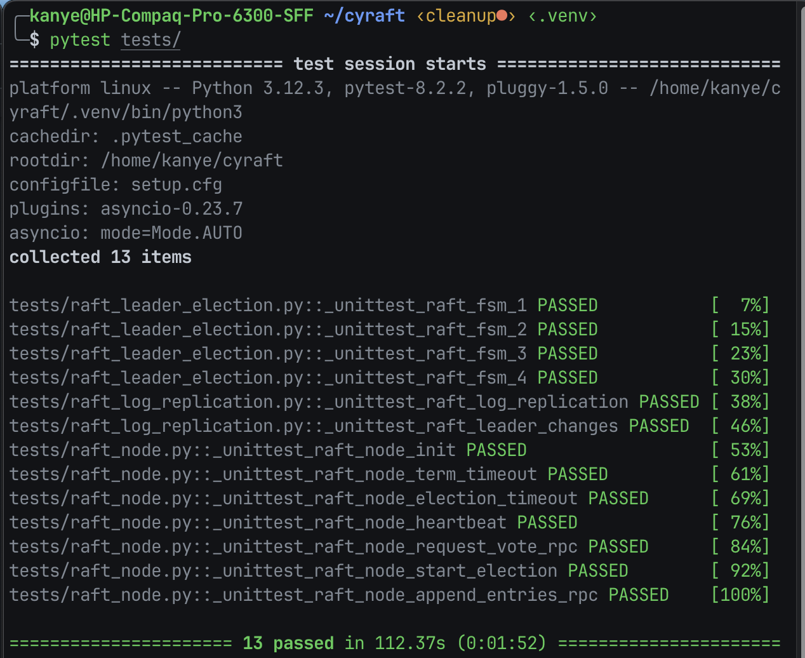
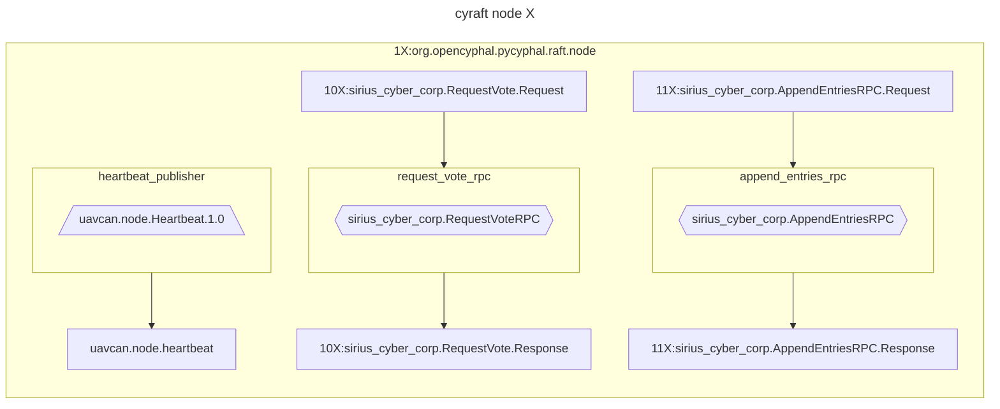
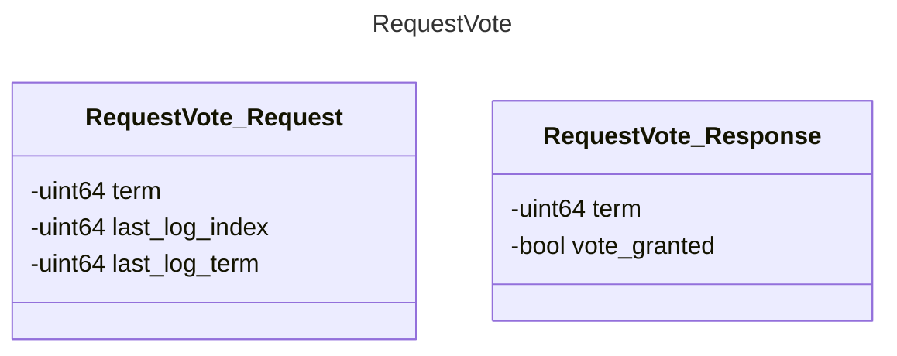
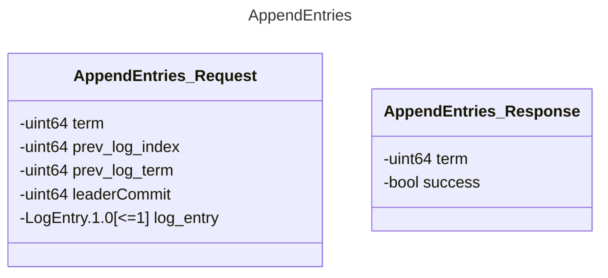

# Cyraft

The objective is to implement the Raft algorithm as an exercise, with the intention of incorporating [named topics](http://wiki.ros.org/Topics) into pycyphal.

This feature is significant because it enables Cyphal to serve as a communication layer between PX4 and ROS in the future.

(See [UAVCAN as a middleware for ROS](https://forum.opencyphal.org/t/an-exploratory-study-uavcan-as-a-middleware-for-ros/872))

- [Cyraft](#cyraft)
  - [TODO](#todo)
  - [Setup](#setup)
  - [Diagrams](#diagrams)
    - [demo\_cyraft](#demo_cyraft)
    - [DSDL datatypes](#dsdl-datatypes)
  - [Sources](#sources)


## TODO

- [x] Finish study pycyphal application layer
- [ ] `demo_cyraft.py`
    - [x] Add instructions on how to interact with request_vote_rpc using `yakut`
    - [x] Vscode debug setup
    - [x] RaftNode unit tests
      - [x] _unittest_raft_node_init
      - [x] _unittest_raft_node_term_timeout
      - [x] _unittest_raft_node_election_timeout
      - [x] _unittest_raft_node_election_timeout_heartbeat
      - [x] _unittest_raft_node_request_vote_rpc
      - [x] _unittest_raft_node_append_entries_rpc
    - [ ] tests
      - [x] `leader_election.py`
        - [ ] some warning need to be fixed here:
          - [ ] _unittest_raft_node_term_timeout
          - [ ] _unittest_raft_node_start_election
      - [ ] `log_replication.py`
        - [x] `_unittest_raft_log_replication`
        - [ ] `_unittest_raft_leader_changes`
      - [ ] `leader_commit` needs to integrated/tested
    - [ ] Test using orchestration so there's 3 nodes running simultanously
      - [ ] use yakut to send AppendEntries requests
    - [ ] [Add name resolution service](https://github.com/OpenCyphal-Garage/cyraft/issues/3)
    - [ ] [Monitor the network for online nodes](https://github.com/OpenCyphal-Garage/cyraft/issues/4)
  - [ ] `.env-variables` and `my_env.sh` should be combined?
  - [ ] Implement Github CI
-  [x] Refactor code into `cyraft`

Questions:

- `cyraft/node.py`:
  - [x] how to close properly? (fixed when running a single test, however still happens when running multiple)
- `tests/leader_election.py`:
  - [x] difference of 1 term between node is not enough to determine who gets elected first (-> tested in raft_leader_election, test stage 8/9)
  - [x] Some strange error prinouts in test stage 10/11

Code improvements:
- [x] currently not using network to send requests, fix this
  - https://pycyphal.readthedocs.io/en/stable/api/pycyphal.application.html#rpc-service-clients-and-servers
  - in `_send_heartbeat`: there should be some timeout if node doesn't respond
- [x] election and term timeouts can be done more cleanly
- [ ] move internal variables into RaftState (for example, only leader should have a term it is able to update)
  - Maybe not necessary? It's pretty clean as currently implemented I think.

## Setup

- Clone repo

    ```bash
    git clone git@github.com:OpenCyphal-Garage/cyraft.git
    ```

- Virtual environment

    ```bash
    cd ~/cyraft
    python3 -m venv .venv
    source .venv/bin/activate
    ```
 
- Install requirements (pycyphal)

    ```bash
    cd ~/cyraft
    pip3 install -r requirements.txt
    ```

-   ```bash
    git submodule update --init --recursive
    ```

-   ```bash
    export CYPHAL_PATH="$HOME/cyraft/demo/custom_data_types:$HOME/cyraft/demo/public_regulated_data_types"
    ```

- Set up all necessary environment variables:

-   ```bash
    cd ~/cyraft
    source my_env.sh
    ```

- Run the tests

    ```bash
    cd ~/cyraft
    pytest tests/
    ```

    

- Run the demo (**This does not work yet**)

    ```bash
    python3 demo/demo_cyraft.py
    ```

    > **_NOTE:_**  Sometimes this can give an error if it's using old datatypes, try to remove ~/.pycyphal and recompile DSDL datatypes (running previous command will do this automatically)
    >   ```bash
    >   rm -rf ~/.pycyphal
    >   ```

## Diagrams

### demo_cyraft



### DSDL datatypes





## Sources

[Raft paper](https://raft.github.io/raft.pdf)

[lynix94/pyraft](https://github.com/lynix94/pyraft)

[zhebrak/raftos](https://github.com/zhebrak/raftos)

[dronecan/libuavcan](https://github.com/dronecan/libuavcan/tree/main/libuavcan/include/uavcan/protocol/dynamic_node_id_server/distributed)

[An exploratory study: UAVCAN as a middleware for ROS](https://forum.opencyphal.org/t/an-exploratory-study-uavcan-as-a-middleware-for-ros/872)

[Allocators explanation in OpenCyphal/public_regulated_data_types](https://github.com/OpenCyphal/public_regulated_data_types/blob/master/uavcan/pnp/8165.NodeIDAllocationData.2.0.dsdl)

