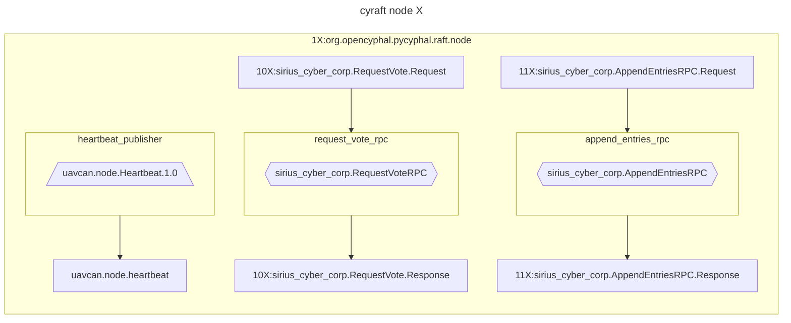
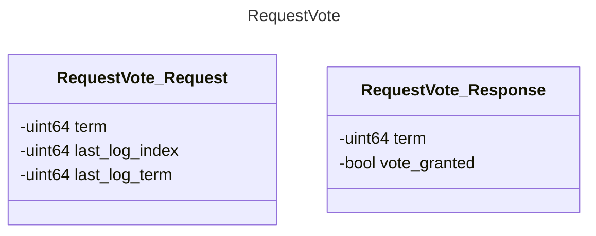
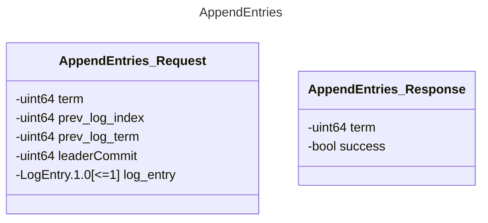

# Cyraft

The objective is to implement the Raft algorithm as an exercise, with the intention of incorporating [named topics](http://wiki.ros.org/Topics) into pycyphal. This feature is significant because it enables Cyphal to serve as a communication interface between PX4 and ROS in the future.

(See [UAVCAN as a middleware for ROS](https://forum.opencyphal.org/t/an-exploratory-study-uavcan-as-a-middleware-for-ros/872))

- [Cyraft](#cyraft)
  - [TODO](#todo)
  - [Setup](#setup)
  - [Diagrams](#diagrams)
    - [demo\_cyraft](#demo_cyraft)
    - [DSDL datatypes](#dsdl-datatypes)
  - [Sources](#sources)


## TODO

30/04: Next step is finishing `Leader election` testing, then `Log replication`

- [x] Finish study pycyphal application layer
- [ ] `demo_cyraft.py`
    - [x] Add instructions on how to interact with request_vote_rpc using `yakut`
    - [x] Vscode debug setup
    - [x] RaftNode unit tests
      - [x] _unittest_raft_node_init
      - [x] _unittest_raft_node_term_timeout
      - [x] _unittest_raft_node_election_timeout
      - [x] _unittest_raft_node_election_timeout_heartbeat
      - [x] _unittest_raft_node_request_vote_rpc
      - [x] _unittest_raft_node_append_entries_rpc
    - [ ] tests
      - [ ] `leader_election.py`
      - [ ] `log_replication.py`
    - [ ] Add orchestration so there's 3 nodes running simultanously
    - [ ] *Leader election*
    - [ ] *Log Replication*
  - [ ] `.env-variables` and `my_env.sh` should be combined?
  - [ ] Implement Github CI
-  [x] Refactor code into `cyraft`

Questions:

- `cyraft/node.py`:
  - `self.log[0]` contains an empty entry, instead of own node info. Made this choice so log is same on all nodes.
  - `metadata`: currently always setting `priority` and `transfer_id` to 0
  - how to close properly? For example see `_unittest_raft_node_term_timeout`
  - how to compare log entries?
- `demo/demo_cyraft.py`:
  - how to import properly?
- `tests/leader_election.py`:
  - current_term is variable, don't know if this is an "issue"? -> maybe it's already fixed
  - somehow stopping between CANDIDATE and LEADER? -> not really necessary, as long as we have prev_state, would probably make it more complicted than necessary
  - difference of 1 term between node is not enough to determine who gets elected first
- general:
  - how to integrate with pycyphal?

Code improvements:
- create an RPC server is not optional
  - why is try/except not ok?
- election and term timeouts can be done more cleanly
- move internal variables into RaftState (for example, only leader should have a term it is able to update)

## Setup

- Clone repo

    ```bash
    git clone https://github.com/maksimdrachov/cyraft_project
    ```

- Virtual environment

    ```bash
    cd ~/cyraft
    python3 -m venv env
    source env/bin/activate
    ```
 
- Install requirements (pycyphal)

    ```bash
    cd ~/cyraft
    pip3 install -r requirements.txt
    ```

-   ```bash
    cd ~/cyraft/demo
    git clone https://github.com/OpenCyphal/public_regulated_data_types
    ```

-   ```bash
    export CYPHAL_PATH="$HOME/cyraft/demo/custom_data_types:$HOME/cyraft/demo/public_regulated_data_types"
    ```

- Set environment variables (registers)

    ```bash
    cd ~/cyraft
    source my_env.sh
    ```

- Run the demo

    ```bash
    python3 demo/demo_cyraft.py
    ```

    > **_NOTE:_**  Sometimes this can give an error if it's using old datatypes, try to remove ~/.pycyphal and recompile DSDL datatypes (running previous command will do this automatically)
    >   ```bash
    >   rm -rf ~/.pycyphal
    >   ```


## Diagrams

### demo_cyraft



### DSDL datatypes





## Sources

[Raft paper](https://raft.github.io/raft.pdf)

[lynix94/pyraft](https://github.com/lynix94/pyraft)

[zhebrak/raftos](https://github.com/zhebrak/raftos)

[dronecan/libuavcan](https://github.com/dronecan/libuavcan/tree/main/libuavcan/include/uavcan/protocol/dynamic_node_id_server/distributed)

[An exploratory study: UAVCAN as a middleware for ROS](https://forum.opencyphal.org/t/an-exploratory-study-uavcan-as-a-middleware-for-ros/872)

[Allocators explanation in OpenCyphal/public_regulated_data_types](https://github.com/OpenCyphal/public_regulated_data_types/blob/master/uavcan/pnp/8165.NodeIDAllocationData.2.0.dsdl)

