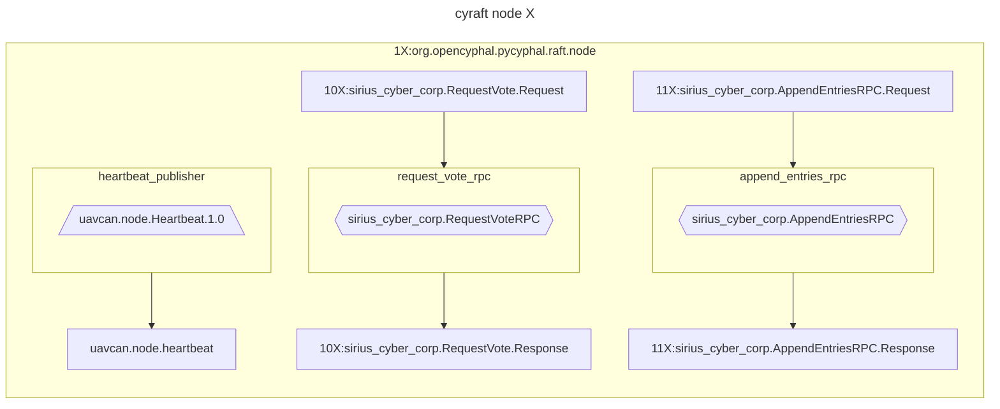
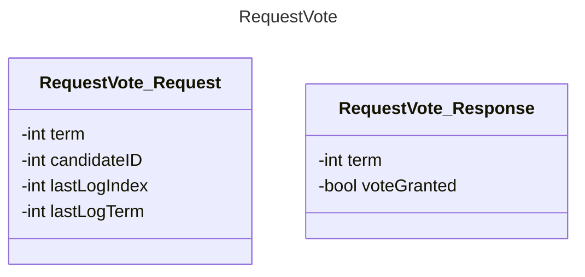
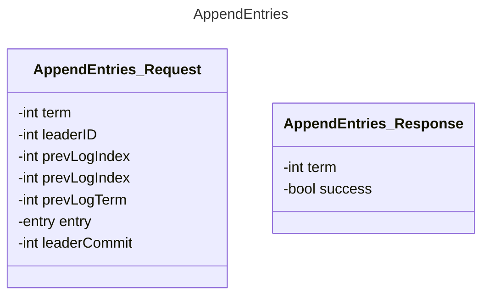

# Cyraft

This is an exercise in implemeting the Raft algorithm, as it could be useful within pycyphal, in order to implement "named topics". The reason why we're interested in supporting "named topics": this could (eventually) be leveraged to allow Cyphal to function as a communication layer between PX4 and ROS. (See [UAVCAN as a middleware for ROS](https://forum.opencyphal.org/t/an-exploratory-study-uavcan-as-a-middleware-for-ros/872))

## TODO

- [x] Finish study pycyphal communication layer
- [ ] `demo_node.py`
- [ ] class diagrams cyraft
- [ ] implement cyraft

## Setup

- Clone repo

    ```bash
    git clone https://github.com/maksimdrachov/cyraft_project
    ```

- Virtual environment

    ```bash
    cd ~/cyraft
    python3 -m venv env
    source env/bin/activate
    ```
 
- Install requirements (pycyphal)

    ```bash
    cd ~/cyraft
    pip3 install -r requirements.txt
    ```

-   ```bash
    cd ~/cyraft/demo
    git clone https://github.com/OpenCyphal/public_regulated_data_types
    ```

-   ```bash
    export CYPHAL_PATH="$HOME/cyraft/demo/custom_data_types:$HOME/cyraft/demo/public_regulated_data_types"
    ```

- Set environment variables (registers)

    ```bash
    cd ~/cyraft
    source my_env.sh
    ```

- Run the demo

    ```bash
    python3 demo/demo_node.py
    ```

## Diagrams

### demo_node



### DSDL datatypes





## Sources

[Raft paper](https://raft.github.io/raft.pdf)

[lynix94/pyraft](https://github.com/lynix94/pyraft)

[zhebrak/raftos](https://github.com/zhebrak/raftos)

[dronecan/libuavcan](https://github.com/dronecan/libuavcan/tree/main/libuavcan/include/uavcan/protocol/dynamic_node_id_server/distributed)

[An exploratory study: UAVCAN as a middleware for ROS](https://forum.opencyphal.org/t/an-exploratory-study-uavcan-as-a-middleware-for-ros/872)

[Allocators explanation in OpenCyphal/public_regulated_data_types](https://github.com/OpenCyphal/public_regulated_data_types/blob/master/uavcan/pnp/8165.NodeIDAllocationData.2.0.dsdl)

