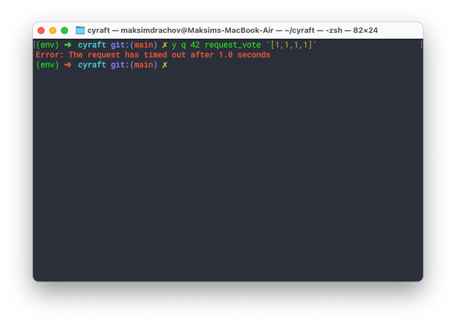
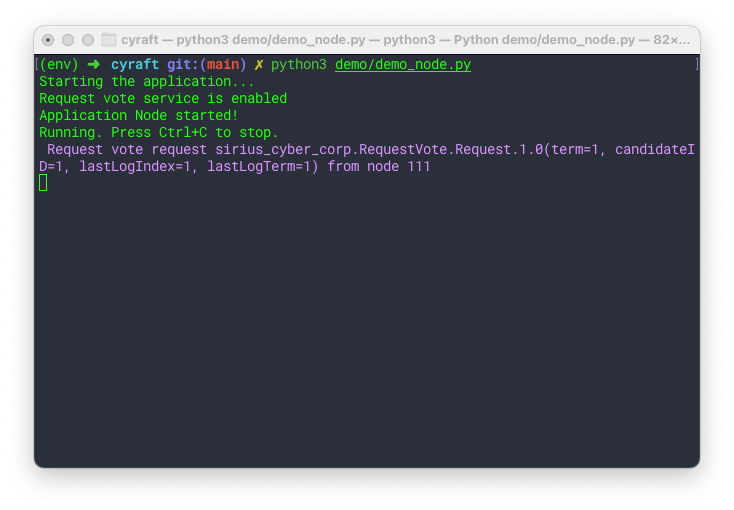

I'm trying to get a response from `request_vote`, after sending a request using Yakut.

The issue is that I'm not getting any response, and the request times out:



The demo node does appear to receive the request correctly:



The code implementing this `request_vote` functionality is as follows:

- Add srv_request_vote to be served in the background:

    ```py
    # Create an RPC-server. (RequestVote)
    try:
        _logger.info("Request vote service is enabled")
        srv_request_vote = self._node.get_server(
            sirius_cyber_corp.RequestVote_1, "request_vote"
        )
        srv_request_vote.serve_in_background(self._serve_request_vote)
    except pycyphal.application.register.MissingRegisterError:
        _logger.info(
            "The request vote service is disabled by configuration (UAVCAN__SRV__REQUEST_VOTE__ID missing)"
        )
    ```

- The `_serve_request_vote` function itself:

    ```py
    @staticmethod
    async def _serve_request_vote(
        # self,
        request: sirius_cyber_corp.RequestVote_1.Request,
        metadata: pycyphal.presentation.ServiceRequestMetadata,
    ) -> sirius_cyber_corp.RequestVote_1.Response:
        _logger.info(
            "\033[94m Request vote request %s from node %d \033[0m",
            request,
            metadata.client_node_id,
        )

        return sirius_cyber_corp.RequestVote_1.Response(
            term=1,
            vote_granted=True,
        )
    ```

This is pretty much the same way it is done in the demo example from pycyphal.

The only thing I'm unclear about is whether it might have something to do the way `run()` is implemented:

```py
async def run(self) -> None:
    """
    The main method that runs the business logic. It is also possible to use the library in an IoC-style
    by using receive_in_background() for all subscriptions if desired.
    """
    _logger.info("Application Node started!")
    _logger.info("Running. Press Ctrl+C to stop.")

    while True:
        await asyncio.sleep(0.1)
```

In the demo example, there's more setup code here, however nothing related to the service (`least_square` in their case.)

